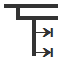

# vscode-snippets-viewer

[](http://opensource.org/licenses/GPL-3.0)
[](https://marketplace.visualstudio.com/items?itemName=RandomFractalsInc.snippets-viewer)
[](https://marketplace.visualstudio.com/items?itemName=RandomFractalsInc.snippets-viewer)
[](https://marketplace.visualstudio.com/items?itemName=RandomFractalsInc.snippets-viewer)
<a href='https://ko-fi.com/dataPixy' target='_blank' title='support: https://ko-fi.com/dataPixy'>
  </a>
<hr />
<h1 align="center">
  <a title="Learn more about Snippets Viewer" href="https://github.com/RandomFractals/vscode-snippets-viewer">
    
  </a>
  <br />
  Snippets Viewer ⇥ for VSCode
</h1>

# Support

[Snippets Viewer](https://github.com/RandomFractals/vscode-snippets-viewer) ⇥ was created to simplify navigation and preview of [code snippets](https://code.visualstudio.com/docs/editor/userdefinedsnippets#_install-snippets-from-the-marketplace) from built-in [languages](https://marketplace.visualstudio.com/search?target=VSCode&category=Programming%20Languages&sortBy=Installs) and [extension snippets](https://marketplace.visualstudio.com/search?target=VSCode&category=Snippets&sortBy=Installs).

Please consider becoming a [Fan](https://github.com/sponsors/RandomFractals/sponsorships?tier_id=18883&preview=false) and sponsoring our dev efforts on this and other [Random Fractals, Inc.](https://twitter.com/search?q=%23RandomFractalsInc&src=typed_query&f=live) code and [data viz extensions](https://marketplace.visualstudio.com/publishers/RandomFractalsInc) if you find them useful, educational, or enhancing your daily dataViz/dev code workflows:

☕️ https://ko-fi.com/dataPixy
💖 https://github.com/sponsors/RandomFractals

# Snippets Viewer


# Features

- View [built-in](https://code.visualstudio.com/docs/editor/userdefinedsnippets#_builtin-snippets) and [extension snippets](https://code.visualstudio.com/docs/editor/userdefinedsnippets#_install-snippets-from-the-marketplace) grouped by language in the Snippets Tree View ⎇
- View [user-defined](https://code.visualstudio.com/docs/editor/userdefinedsnippets#_create-your-own-snippets) language snippets
- View [project-scoped](https://code.visualstudio.com/docs/editor/userdefinedsnippets#_snippet-scope) language snippets for workspaces with multiple folders
- Combine language snippets without snippets file grouping display in the Snippets Tree View ⎇
- Toggle [built-in](https://code.visualstudio.com/docs/editor/userdefinedsnippets#_builtin-snippets) language extension snippets display
- Skip language snippets option for the specified languages in extension settings
- Expand snippet files on snippet language tree node expand
- Auto-select and expand language snippets on active text editor change
- Show only snippets for the active text editor language
- See snippet prefix and shortcut keystrokes in the Snippets Tree View ⎇
- View snippet description and preview snippet body in the Snippets Tree View ⎇ markdown tooltip
- Insert a snippet from the Snippets Tree View ⎇ into the active code text editor
- Open snippets file to view snippets JSON config
- Go to the snippet definition in a snippet file
- Sort snippets by definition order in a snippet file
- Sort snippets by name
- View Snippets Viewer settings

# VSCode Contributions

Snippets Viewer ⇥ extension Settings, Commands, and VSCode Views:


# Installation

Install [Snippets Viewer ⇥](https://marketplace.visualstudio.com/items?itemName=RandomFractalsInc.snippets-viewer) via VSCode Extensions tab (`Ctrl+Shift+X`) by searching for `snippets viewer` || via [VSCode marketplace search results](https://marketplace.visualstudio.com/search?term=snippets%20viewer&target=VSCode&category=All%20categories&sortBy=Relevance).


# Configuration

[Create User or Workspace Settings in VSCode](http://code.visualstudio.com/docs/customization/userandworkspace#_creating-user-and-workspace-settings) to change default Snippets Viewer ⇥ extension Settings:


**Note**: All Snippets Viewer ⎇ Settings start with `snippets.viewer.` prefix.
Example of [`.vscode/settings.json`](https://github.com/RandomFractals/vscode-snippets-viewer/blob/main/.vscode/settings.json) you can use to specify Snippets Viewer ⎇ Settings in open project Workspace to overwrite global User [settings](https://code.visualstudio.com/docs/getstarted/settings#_settingsjson) and toggle Snippets tree view display options listed below:

```
{
  // Local Snippets viewer settings
  "snippets.viewer.sortSnippetsByName": false,
  "snippets.viewer.combineLanguageSnippets": true,
  "snippets.viewer.expandSnippetFiles": true
}
```

| Setting Name | Type | Default Value | Description |
| ------- | ---- | ------------- | ----------- |
| `combineLanguageSnippets` | boolean | `false` | Combine language snippets in the Snippets tree view.|
| `expandSnippetFiles` | boolean | `false` | Expand snippet files on snippet language tree node expand in the Snippets tree view.|
| `focusOnActiveEditorSnippets` | boolean | `false` | Focus on active editor snippets when Snippets tree view is visible. |
| `showBuiltInExtensionSnippets` | boolean | `true` | Show built-in language extension snippets in the Snippets tree view. |
| `showOnlyActiveEditorLanguageSnippets` | boolean | `false` | Show only active editor language snippets in the Snippets tree view. |
| `skipLanguageSnippets` | string | | Comma delimited list of languages to skip snippets display in the Snippets tree view. |
| `sortSnippetsByName` | boolean | `false` | Sort loaded snippets by name in Snippets tree view. |

# Dev Build

Use the following commands to build this Snippets Viewer VSCcode extension locally for debugging and submitting pull requests (PRs):

```
$ git clone https://github.com/RandomFractals/vscode-snippets-viewer
$ cd vscode-snippets-viewer
$ npm install
$ code .
```

Watch for changes:

```
$ npm run-script watch
```

Press `F5` in VSCode to start Snippets Viewer extension debug session.

# Contributions

Any & all test, code || feedback contributions are welcome.

Open an issue || create a pull request to make this Snippets Viewer VSCode extension work better for all. 🤗
